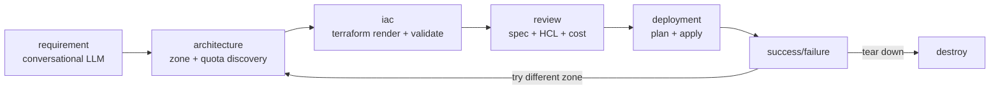

# VibeOps

> **An AI agent that safely operates your cloud — describe the change, review the plan, approve, done.**

VibeOps turns a plain-English request into real infrastructure. You describe what you
want; it extracts the intent, discovers where it can run, generates the Terraform,
prices it, and — **only after you approve** — provisions it on your cloud. One click
tears it all back down and stops the meter.

Today the beachhead is **GPU VMs on Google Cloud**: the exact task that's fiddly enough
to be painful and repetitive enough to be worth automating. Bring your own OpenAI key and
a GCP service-account JSON — nothing is bundled, nothing is persisted.

<p align="center">
  
</p>

<p align="center">
  <em>🚀 Try the live demo (no credentials needed):
  <a href="https://huggingface.co/spaces/karankendre/VibeOps">huggingface.co/spaces/karankendre/VibeOps</a></em>
</p>

---

## The problem

Standing up a single GPU box on GCP is death by a thousand steps. You pick a machine
type, hunt for a zone that actually has GPU quota, find an OS image that ships CUDA,
hand-write the Terraform, open the right firewall ports, `validate`, `apply`, SSH in,
install your stack, debug the startup script — and then remember to tear it all down
before it quietly bills you all month.

VibeOps collapses those nine steps into one sentence:

> *"Jupyter notebook on a T4 with port 8888 open to the web"*

<p align="center">
  
</p>

---

## How it works

Every request runs the same **six-stage pipeline**. The agent pauses for you at each
decision — nothing touches your cloud until you approve, and the whole plan is checked
against a resource allowlist before anything is applied.

| Stage | What happens |
|---|---|
| **1 · Understand** | One LLM pass pulls every detail from your words — GPU, ports, OS, region — then asks plain-language follow-ups for anything still missing. It never re-asks what you already said. |
| **2 · Locate** | Live GCP lookups for accelerator availability and your project quota, ranked by free capacity, so the box lands where there's actually room. |
| **3 · Generate** | Renders valid, scoped Terraform — firewall rules, startup scripts, and container metadata included. Edit the HCL inline before anything runs. |
| **4 · Price** | Estimates monthly cost from a maintained GCP price table (or Infracost when configured) and holds it against your cap. Over budget fails closed unless you override. |
| **5 · Deploy** | Checks the plan against a resource allowlist, then `terraform apply` — only after you approve. The live log streams as resources come up. |
| **6 · Live** | Hands back a clickable URL the moment the box is up. One click tears everything down and stops the meter. |

<p align="center">
  
</p>

---

## See it in action

The whole flow is walkable in **demo mode** with no credentials — deployment is simulated,
so no real cloud resources are created.

**1. Connect your cloud (or explore in demo mode).** Paste an OpenAI key and a GCP
service-account JSON, pick a project, set a monthly cost cap — or click *Try the live demo*.

<p align="center">
  
</p>

**2. Review the plan.** The generated spec, a live cost estimate (with a hard budget cap),
and the editable Terraform — side by side. Nothing has been created yet.

<p align="center">
  
</p>

**3. Approve & deploy.** Watch the Terraform apply stream in real time, then get a live VM
with its external IP, an SSH command, and a one-click teardown.

<p align="center">
  
</p>

**4. Manage your fleet.** See every VM in your project from any screen; multi-select and
tear down with confirmation.

<p align="center">
  
</p>

---

## What it does

<p align="center">
  
</p>

- 🧠 **Intent extraction** — the first LLM call pulls every detail out of your prompt (GPU type, ports, preemptible, container, OS, region). It never re-asks what you already said.
- 💬 **Plain-language conversation** — no GCP jargon. *"How much RAM do you need? 16 / 32 / 64 / 128 GB"* instead of *"What's your memory floor?"*
- 🗺️ **GPU-aware zone discovery** — live queries to GCP for accelerator availability + your project quota, ranked by free capacity.
- 📄 **Editable Terraform** — generated HCL is shown side-by-side with the spec. Edit it inline; it's re-validated before deploy.
- 💸 **Cost estimate** — from a maintained GCP price table (or Infracost when configured), with a hard cost cap you can override.
- 🔥 **Firewall + startup script + container support** — say *"with port 443 open running nginx"* and you get a `google_compute_firewall`, COS metadata, and a clickable `https://<ip>` on the success screen.
- 🛰️ **Live VM inventory** — see every VM in your project from any screen. Multi-select tear-down with confirmation.
- 🔁 **Capacity-failure recovery** — if a zone has no quota at apply time, one click retries in a different zone.
- 🔒 **Safe by construction** — a resource-type allowlist (`compute_instance`, `compute_disk`, `compute_attached_disk`, `compute_firewall`) is enforced before every apply. No surprises.

---

## Tech stack

| Layer | Tech |
|---|---|
| Frontend | React 18 + TypeScript + Tailwind + Framer Motion (Vite), cosmic-magenta-on-black theme with a cinematic landing |
| API / server | FastAPI + Uvicorn — serves the SPA and the JSON/SSE API on one port |
| Orchestration | LangGraph state machine with interrupt-driven pauses |
| LLM | OpenAI (configurable model; `gpt-4o-mini` for chat, `gpt-4o` for HCL fragments) |
| IaC | Terraform + Jinja2 templates with conditional firewall / startup / container blocks |
| GCP client | `google-cloud-compute`, `google-cloud-resource-manager`, `google-cloud-billing` |
| State | Pydantic models, in-memory LangGraph checkpointer + per-session server store |
| Tests | pytest (backend, 410+ unit tests) + Vite build / tsc / eslint (frontend) |

---

## Quick start (local)

```bash
git clone https://github.com/KaranKendre11/VibeOps.git
cd VibeOps

# Backend (Python 3.11+):
python -m pip install uv
python -m uv sync

# Frontend (Node 18+):
cd frontend && npm install && npm run build && cd ..

# Terraform CLI required on PATH:
# macOS:    brew install terraform
# Windows:  winget install Hashicorp.Terraform
# Linux:    https://developer.hashicorp.com/terraform/install

# Run everything (built SPA + API on one port):
python -m uv run uvicorn vibeops.api.main:app --port 8000
```

Open <http://localhost:8000>, paste your OpenAI key and a GCP service-account JSON with
`compute.admin` + `resourcemanager.projects.get` on at least one project — or click
**Try the live demo** to explore with no credentials.

For frontend hot-reload during development: run the API (`uvicorn … --port 8000`) and, in
another shell, `cd frontend && npm run dev` (Vite proxies `/api` → `:8000`); open the Vite
dev URL.

---

## Architecture

VibeOps is a six-stage LangGraph state machine. Each stage has its own agent + UI screen,
and the graph pauses at interrupt points so the UI can collect user input.



Key design choices:

- **The LangGraph state is the single source of truth.** The API's in-memory per-session store is a thin cache; everything that matters lives in `GraphState`.
- **`interrupt_before` pauses the graph mid-flow.** The API reads the paused state, collects input from the React client, writes back via `graph.update_state(... as_node=...)`, then resumes with `graph.invoke(None, ...)`.
- **Architecture is deterministic, not LLM-driven.** GCP zone + quota lookups are concurrent (ThreadPoolExecutor), candidates ranked by free capacity. The LLM only handles the conversational requirement gathering.
- **Resource allowlist policy.** Generated Terraform is parsed and checked against `ALLOWED_RESOURCE_TYPES = {compute_instance, compute_disk, compute_attached_disk, compute_firewall}` before apply.
- **Cost cap with override.** Hard fail above your configured monthly cap unless you tick the override checkbox.

---

## Project layout

```
src/vibeops/
├── api/                # FastAPI app, routers, cookie session store, graph runtime
├── services/           # UI-agnostic logic (Terraform-edit validation, conversation)
├── agents/             # requirement, architecture, iac, deployment, destroy agents
├── core/               # llm client, gcp context, auth, policy, analytics, logging
├── cost/               # Infracost + GCP price-table cost adapters
├── graph/              # LangGraph orchestrator + router functions
├── models/             # Pydantic state + spec + result models
├── terraform/          # Jinja2 templates, runner subprocess, error parser
└── tools/              # GCP compute + resource_manager API wrappers

frontend/               # React 18 + TS + Tailwind + Framer Motion (Vite) SPA
tests/                  # 400+ backend unit tests, optional live integration tests
Dockerfile              # HF Spaces image (Node build → uvicorn runtime)
```

---

## Bring-your-own credentials

VibeOps never bundles credentials. Each visitor pastes:

1. **An OpenAI API key** — used only for the requirement-gathering chat and a single HCL-fragment LLM call. No tools, no agents-as-a-service.
2. **A GCP service-account JSON** — needs `compute.admin` (to provision VMs) and `resourcemanager.projects.get` (to list projects). Credentials live only in an in-memory per-session store server-side (keyed by an httpOnly cookie) and are never written to disk.

Both can be cleared from any screen via **⚙ Settings → Reconfigure**.

---

## Live demo

🚀 **Try it on Hugging Face Spaces:** <https://huggingface.co/spaces/karankendre/VibeOps>

First load may be slow (~30s wake-up if the Space has been idle). You'll need to paste your
own OpenAI key and a GCP service-account JSON — or use the built-in **demo mode** to walk
the entire flow with representative data and a simulated deploy (no real cloud resources are
created). Everything you paste stays in your browser session and is never logged.

---

## Built by

[Karan Kendre](https://github.com/KaranKendre11) — `kendre.k@northeastern.edu`

PRs and issues welcome.

## License

MIT — see [LICENSE](LICENSE).
