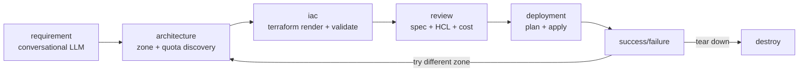

# VibeOps

> **An AI agent that safely operates your cloud — describe the change, review the plan, approve, done.**
> Today it provisions and tears down GPU VMs on GCP (the beachhead). Describe what you want in plain English; VibeOps turns your request into a reviewed Terraform plan, enforces a resource-type allowlist, shows you a cost estimate, and only touches your cloud after you approve.

<p align="center">
  
</p>

---

## Why VibeOps?

Spinning up a GPU VM on GCP usually means: pick a machine type, find a zone with quota, find an OS image that has CUDA, write Terraform, open the right firewall ports, validate, apply, SSH in, install your stack, debug startup scripts, tear it down when done.

VibeOps collapses all of that into one chat:

> *"Jupyter notebook on a T4 with port 8888 open to the web"*

The system extracts the intent, asks plain-language follow-ups for anything missing, finds a zone with quota, generates valid Terraform, shows you a cost estimate, lets you edit the HCL if you want, deploys it, and gives you a clickable URL when it's up. One click tears it all down.

---

## What it does

- 🧠 **Intent extraction** — the first LLM call pulls every detail out of your prompt (GPU type, ports, preemptible, container, OS, region). It never re-asks what you already said.
- 💬 **Plain-language conversation** — no GCP jargon. *"How much RAM do you need? 16 / 32 / 64 / 128 GB"* instead of *"What's your memory floor?"*
- 🗺️ **GPU-aware zone discovery** — live queries to GCP for accelerator availability + your project quota, ranked by free capacity.
- 📄 **Editable Terraform** — generated HCL is shown side-by-side with the spec. Edit it inline; it's re-validated before deploy.
- 💸 **Real-time cost estimate** — pulled from GCP Cloud Catalog (or Infracost if available). Cost cap with override.
- 🔥 **Firewall + startup script + container support** — say *"with port 443 open running nginx"* and you get a `google_compute_firewall`, COS metadata, and a clickable `https://<ip>` on the success screen.
- 🛰️ **Live VM inventory** — see every VM in your project from any screen. Multi-select tear-down with confirmation.
- 🔁 **Capacity-failure recovery** — if a zone has no quota at apply time, one click retries in a different zone.
- 🧹 **Local credential cache** — credentials live in `~/.vibeops/credentials.json` (never the server). One-click Reconfigure to wipe.

<p align="center">
  
</p>

---

## Tech stack

| Layer | Tech |
|---|---|
| Frontend | React 18 + TypeScript + Tailwind + Framer Motion (Vite), cyan-on-black theme |
| API / server | FastAPI + Uvicorn — serves the SPA and the JSON/SSE API on one port |
| Orchestration | LangGraph state machine with interrupt-driven pauses |
| LLM | OpenAI (configurable model; gpt-4o-mini for chat, gpt-4o for HCL fragments) |
| IaC | Terraform + Jinja2 templates with conditional firewall / startup / container blocks |
| GCP client | `google-cloud-compute`, `google-cloud-resource-manager`, `google-cloud-billing` |
| State | Pydantic models, in-memory LangGraph checkpointer + per-session server store |
| Tests | pytest (backend, 410+ unit tests) + Vite build / tsc / eslint (frontend) |

---

## Quick start (local)

```bash
git clone https://github.com/<your-username>/vibeops.git
cd vibeops

# Backend (Python 3.11+):
python -m pip install uv
python -m uv sync

# Frontend (Node 18+):
cd frontend && npm install && npm run build && cd ..

# Terraform CLI required on PATH:
# macOS:    brew install terraform
# Windows:  winget install Hashicorp.Terraform
# Linux:    https://developer.hashicorp.com/terraform/install

# Run everything (built SPA + API on one port):
python -m uv run uvicorn vibeops.api.main:app --port 8000
```

Open <http://localhost:8000>, paste your OpenAI key and a GCP service-account JSON with `compute.admin` + `resourcemanager.projects.get` on at least one project — or click **Try the live demo** to explore with no credentials.

For frontend hot-reload during development: run the API (`uvicorn … --port 8000`) and, in another shell, `cd frontend && npm run dev` (Vite proxies `/api` → `:8000`); open the Vite dev URL.

---

## Architecture

VibeOps is a six-stage LangGraph state machine. Each stage has its own agent + UI screen, and the graph pauses at interrupt points so the UI can collect user input.



Key design choices:

- **The LangGraph state is the single source of truth.** The API's in-memory per-session store is a thin cache; everything that matters lives in `GraphState`.
- **`interrupt_before` pauses the graph mid-flow.** The API reads the paused state, collects input from the React client, writes back via `graph.update_state(... as_node=...)`, then resumes with `graph.invoke(None, ...)`.
- **Architecture is deterministic, not LLM-driven.** GCP zone + quota lookups are concurrent (ThreadPoolExecutor), candidates are ranked by free capacity. The LLM only handles the conversational requirement gathering.
- **Resource allowlist policy.** Generated Terraform is parsed and checked against `ALLOWED_RESOURCE_TYPES = {compute_instance, compute_disk, compute_attached_disk, compute_firewall}` before apply. No surprises.
- **Cost cap with override.** Hard fail above your configured monthly cap unless you tick the override checkbox.

---

## Project layout

```
src/vibeops/
├── api/                # FastAPI app, routers, cookie session store, graph runtime
├── services/           # UI-agnostic logic (Terraform-edit validation, conversation)
├── agents/             # requirement, architecture, iac, deployment, destroy agents
├── core/               # llm client, gcp context, auth, policy, analytics, logging
├── cost/               # Infracost + Cloud Catalog cost adapters
├── graph/              # LangGraph orchestrator + router functions
├── models/             # Pydantic state + spec + result models
├── terraform/          # Jinja2 templates, runner subprocess, error parser
└── tools/              # GCP compute + resource_manager API wrappers

frontend/               # React 18 + TS + Tailwind + Framer Motion (Vite) SPA
tests/                  # 400+ backend unit tests, optional live integration tests
Dockerfile              # HF Spaces image (Node build → uvicorn runtime)
```

---

## Bring-your-own credentials

VibeOps never bundles credentials. Each visitor pastes:

1. **An OpenAI API key** — used only for the requirement-gathering chat and a single HCL-fragment LLM call. No tools, no agents-as-a-service.
2. **A GCP service-account JSON** — needs `compute.admin` (to provision VMs) and `resourcemanager.projects.get` (to list projects). Credentials live only in an in-memory per-session store server-side (keyed by an httpOnly cookie) and are never written to disk.

Both can be cleared from any screen via **⚙ Settings → Reconfigure**.

---

## Live demo

🚀 **Try it on Hugging Face Spaces:** <https://huggingface.co/spaces/karankendre/VibeOps>

First load may be slow (~30s wake-up if the Space has been idle). You'll need to paste your own OpenAI key and a GCP service-account JSON — both stay in your browser session and are never logged.

---

## Built by

[Karan Kendre](https://github.com/KaranKendre11) — `kendre.k@northeastern.edu`

PRs and issues welcome.

## License

MIT — see [LICENSE](LICENSE).
