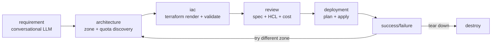

# VibeOps

> **Natural language → a running GPU VM on Google Cloud, in minutes.**
> Bring your own OpenAI key and GCP service-account JSON, describe what you want, and VibeOps takes care of the Terraform.

<p align="center">
  
</p>

---

## Why VibeOps?

Spinning up a GPU VM on GCP usually means: pick a machine type, find a zone with quota, find an OS image that has CUDA, write Terraform, open the right firewall ports, validate, apply, SSH in, install your stack, debug startup scripts, tear it down when done.

VibeOps collapses all of that into one chat:

> *"Jupyter notebook on a T4 with port 8888 open to the web"*

The system extracts the intent, asks plain-language follow-ups for anything missing, finds a zone with quota, generates valid Terraform, shows you a cost estimate, lets you edit the HCL if you want, deploys it, and gives you a clickable URL when it's up. One click tears it all down.

---

## What it does

- 🧠 **Intent extraction** — the first LLM call pulls every detail out of your prompt (GPU type, ports, preemptible, container, OS, region). It never re-asks what you already said.
- 💬 **Plain-language conversation** — no GCP jargon. *"How much RAM do you need? 16 / 32 / 64 / 128 GB"* instead of *"What's your memory floor?"*
- 🗺️ **GPU-aware zone discovery** — live queries to GCP for accelerator availability + your project quota, ranked by free capacity.
- 📄 **Editable Terraform** — generated HCL is shown side-by-side with the spec. Edit it inline; it's re-validated before deploy.
- 💸 **Real-time cost estimate** — pulled from GCP Cloud Catalog (or Infracost if available). Cost cap with override.
- 🔥 **Firewall + startup script + container support** — say *"with port 443 open running nginx"* and you get a `google_compute_firewall`, COS metadata, and a clickable `https://<ip>` on the success screen.
- 🛰️ **Live VM inventory** — see every VM in your project from any screen. Multi-select tear-down with confirmation.
- 🔁 **Capacity-failure recovery** — if a zone has no quota at apply time, one click retries in a different zone.
- 🧹 **Local credential cache** — credentials live in `~/.vibeops/credentials.json` (never the server). One-click Reconfigure to wipe.

<p align="center">
  
</p>

---

## Tech stack

| Layer | Tech |
|---|---|
| UI | Streamlit + custom CSS theme (aerukart-inspired cyan-on-black) |
| Orchestration | LangGraph state machine with interrupt-driven pauses |
| LLM | OpenAI (configurable model; gpt-4o-mini for chat, gpt-4o for HCL fragments) |
| IaC | Terraform + Jinja2 templates with conditional firewall / startup / container blocks |
| GCP client | `google-cloud-compute`, `google-cloud-resource-manager`, `google-cloud-billing` |
| State | Pydantic models, in-memory LangGraph checkpointer |
| Tests | pytest, 370+ unit tests, optional live-integration suite |

---

## Quick start (local)

```bash
git clone https://github.com/<your-username>/vibeops.git
cd vibeops

# Python 3.11+ required. uv is fastest:
python -m pip install uv
python -m uv venv && source .venv/bin/activate     # or .venv\Scripts\activate on Windows
python -m uv pip install -e .

# Terraform CLI required on PATH:
# macOS:    brew install terraform
# Windows:  winget install Hashicorp.Terraform
# Linux:    https://developer.hashicorp.com/terraform/install

streamlit run app.py
```

Open <http://localhost:8501>, paste your OpenAI key and a GCP service-account JSON with `compute.admin` + `resourcemanager.projects.get` on at least one project. You're in.

---

## Architecture

VibeOps is a six-stage LangGraph state machine. Each stage has its own agent + UI screen, and the graph pauses at interrupt points so the UI can collect user input.



Key design choices:

- **The LangGraph state is the single source of truth.** Streamlit's session_state is a thin cache layer; everything that matters lives in `GraphState`.
- **`interrupt_before` pauses the graph mid-flow.** UI screens read the paused state, collect user input, write back via `graph.update_state(... as_node=...)`, then resume with `graph.invoke(None, ...)`.
- **Architecture is deterministic, not LLM-driven.** GCP zone + quota lookups are concurrent (ThreadPoolExecutor), candidates are ranked by free capacity. The LLM only handles the conversational requirement gathering.
- **Resource allowlist policy.** Generated Terraform is parsed and checked against `ALLOWED_RESOURCE_TYPES = {compute_instance, compute_disk, compute_attached_disk, compute_firewall}` before apply. No surprises.
- **Cost cap with override.** Hard fail above your configured monthly cap unless you tick the override checkbox.

---

## Project layout

```
src/vibeops/
├── agents/             # requirement, architecture, iac, deployment, destroy agents
├── core/               # secrets, llm client, gcp context, policy, prices
├── cost/               # Infracost + Cloud Catalog cost adapters
├── graph/              # LangGraph orchestrator + router functions
├── models/             # Pydantic state + spec + result models
├── terraform/          # Jinja2 templates, runner subprocess, error parser
├── tools/              # GCP compute + resource_manager API wrappers
└── ui/                 # chat, setup, review, deployment, vm_inventory, theme

tests/                  # 370+ unit tests, optional live integration tests
doc/                    # design docs + screenshots
app.py                  # Streamlit entry point
Dockerfile              # HF Spaces image
```

---

## Bring-your-own credentials

VibeOps never bundles credentials. Each visitor pastes:

1. **An OpenAI API key** — used only for the requirement-gathering chat and a single HCL-fragment LLM call. No tools, no agents-as-a-service.
2. **A GCP service-account JSON** — needs `compute.admin` (to provision VMs) and `resourcemanager.projects.get` (to list projects). Credentials live in `st.session_state` server-side and are also cached locally at `~/.vibeops/credentials.json` for convenience.

Both can be cleared from any screen via **⚙ Settings → Reconfigure**.

---

## Live demo

🚀 **Try it on Hugging Face Spaces:** <https://huggingface.co/spaces/karankendre/VibeOps>

First load may be slow (~30s wake-up if the Space has been idle). You'll need to paste your own OpenAI key and a GCP service-account JSON — both stay in your browser session and are never logged.

---

## Built by

[Karan Kendre](https://github.com/KaranKendre11) — `kendre.k@northeastern.edu`

PRs and issues welcome.

## License

MIT — see [LICENSE](LICENSE).
